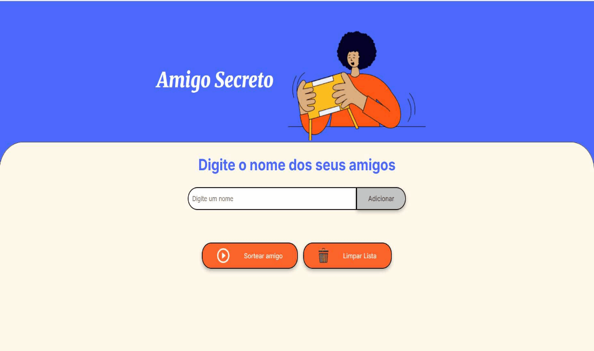

<h1 align="center">🎁 Amigo Secreto Online 🎅</h1>

<p align="center">
  
  
  
</p>

## Índice

*   [Sobre o Projeto](#sobre-o-projeto)
*   [Funcionalidades](#funcionalidades)
*   [Como Usar / Demonstração](#como-usar--demonstração)
*   [Tecnologias Utilizadas](#tecnologias-utilizadas)
*   [Acesso ao Projeto](#acesso-ao-projeto)
*   [Desenvolvedora](#desenvolvedora)
*   [Parceria](#parceria)
*   [Licença](#licença)

---

## 💡Sobre o Projeto

O **Amigo Secreto Online** é uma aplicação web simples e intuitiva, projetada para facilitar a brincadeira tradicional de Amigo Secreto (ou Amigo Oculto). A ferramenta permite registrar participantes e realizar sorteios justos de forma digital, eliminando a necessidade de papéis e garantindo uma organização prática e divertida.

## ✨Funcionalidades

*   **Adição Dinâmica de Nomes:** Insira nomes na lista de forma dinâmica e instantânea.
*   **Validação de Entrada:** Impede a adição de nomes vazios, valores puramente numéricos ou nomes já existentes na lista, garantindo dados consistentes.
*   **Sorteio Aleatório:** Realiza sorteios imparciais.
*   **Remoção Automática do Sorteado:** O nome sorteado é automaticamente removido da lista exibida na tela e da lista interna da aplicação, garantindo que não seja sorteado novamente.
*   **Controle de Participantes Restantes:** Acompanhe visualmente quantos nomes ainda precisam ser sorteados.
*   **Feedback Visual Claro:** Exibe o nome sorteado e fornece alertas quando não há mais nomes para sortear.
*   **Limpeza Manual da Lista:** Um botão dedicado permite resetar todos os participantes e resultados a qualquer momento, facilitando o início de novas rodadas.
*   **Reinício Automático:** A aplicação é reiniciada automaticamente para uma nova brincadeira após todos os nomes serem sorteados.

## 🚀Como Usar / Demonstração 

1.  **Acesse a aplicação:** Abra o link da aplicação hospedada (veja a seção [Acesso ao Projeto](#acesso-ao-projeto)).
2.  **Adicione os nomes:** No campo de texto, digite o nome de um participante e clique no botão "Adicionar". A aplicação validará e adicionará o nome à lista.
3.  **Realize o sorteio:** Após incluir todos os participantes, clique em "Sortear Amigo". O nome sorteado será destacado e removido da lista. Repita o processo até sortear todos. 
4.  **Reinicie a aplicação:** Para começar uma nova rodada a qualquer momento, clique no botão "Limpar Lista" para resetar todos os dados.

 

<p align="center">

</p>

## 💻Tecnologias Utilizadas

*   **HTML5:** Estruturação semântica do conteúdo.
*   **CSS3:** Estilização e responsividade da interface do usuário.
*   **JavaScript:** Lógica principal da aplicação, incluindo manipulação do DOM, validação de entrada, algoritmo de sorteio e gerenciamento do estado.

## 📥Acesso ao Projeto

### Aplicação Online 
<p>
  Acesse a versão hospedada e pronta para uso:
  <br>
  <h4>Vercel</h4>
  <a href="https://amigo-secreto-nu-lake.vercel.app" >
    
    
  </a>
</p>
<p>
  <h4>GitHub Pages</h4>
  <a href="https://laisblockchain.github.io/challenge-amigo-secreto-ONE/" >
    
  </a>
</p>


### ⬇️Rodar Localmente

Para ter uma cópia do projeto em sua máquina e executá-lo:

```bash
# 1. Clone este repositório para o seu ambiente local
git clone https://github.com/laisblockchain/challenge-amigo-secreto-ONE.git

# 2. Navegue até o diretório do projeto
cd SEU_REPOSITORIO

# 3. Abra o arquivo `index.html` em seu navegador web preferido.
#   (Sugestão: Utilize extensões de servidor local como o "Live Server" do VS Code para facilitar o desenvolvimento.)
```

## 👩‍💻Desenvolvedora
<p>
  <a href="https://github.com/laisblockchain" >
    
  </a>
  Laís Helena
</p>

## 🤝Parceria

Este projeto foi desenvolvido como parte do programa [Oracle Next Education](https://www.oracle.com/br/education/oracle-next-education/) em colaboração com a [Alura](https://www.alura.com.br/).

<p align="left">
  
  
</p>

## ✅Licença
<p>
  <a href="https://opensource.org/licenses/MIT" >
    
  </a>
</p>
